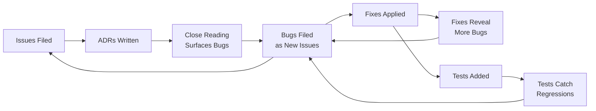

# ADR-Guided Code Quality and Issue-Driven Development: v0.17.0 to v0.18.0

## Executive Summary

The v0.18.0 release (68 merged PRs, 59 closed issues, 16 new ADRs) demonstrates a
development cycle where Architecture Decision Records served not merely as
documentation but as an active code-review mechanism. Writing ADRs forced close
reading of the codebase, which surfaced latent bugs; those bugs were filed as
issues, fixed in PRs, and sometimes revealed further bugs -- creating productive
cascades of improvement. Concurrently, an issues-driven development methodology
ensured every change was traceable to a filed issue, ADRs decomposed into ordered
implementation issue chains, and bug discoveries were immediately captured rather
than deferred.

---

## Part 1: Issues-Driven Development

### 1.1 The Methodology

Every code change in v0.18.0 traces back to a GitHub issue. The project used three
distinct patterns of issue-driven work:

**Pattern A -- Coordinated Quality Baseline Issues (#86-#92)**

Seven issues were filed simultaneously as a "code quality baseline" initiative:

| Issue | Purpose | Outcome |
|-------|---------|---------|
| #86   | Introduce Architecture Decision Records | 16 ADRs written |
| #87   | Add ARCHITECTURE.md | Comprehensive system design doc |
| #88   | Increase test coverage (1:53 ratio identified) | Property-based + unit tests across 13+ modules |
| #89   | Enforce coverage thresholds in CI | Codecov enforcement with fail-on-error |
| #90   | Add security scanning | Audit, dependency policy, secret scanning workflows |
| #91   | Enhance clippy/lint configuration | Pedantic + nursery lint groups enabled |
| #92   | Add project style guide | STYLE-0001 through STYLE-0023 |

These formed a foundation. Issue #89 explicitly depended on #88 (can't enforce
thresholds until coverage exists). Issue #86 spawned 17 child issues (#94-#111),
one per architectural decision to document.

**Pattern B -- ADR-First Feature Design**

Major features were designed as ADRs before any code was written. The ADR issue
contained a dependency graph, and implementation was decomposed into ordered
sub-issues. The clearest example is the split-dispatch feature:

```
Issue #192 (ADR: Per-File Diff Splitting)
  |
  +-- #231  Per-file and per-hunk diff parser (no deps)
  +-- #232  Store per-file diffs (depends: #231)
  +-- #233  Token estimation via per-file sizes (depends: #232)
  +-- #234  Greedy file-packing algorithm (depends: #231, #233)
  +-- #235  Split dispatch for amendments (depends: #232-#234)
  +-- #236  Split dispatch for check (depends: #232-#236)
  +-- #237  Remove quality-degrading fallbacks (depends: #235-#236)
  +-- #238  Integration tests (depends: #235-#237)
  +-- #247  Extend to multi-commit + PR paths (depends: #237)
  +-- #251  Per-hunk partial views (discovered during #238)
```

Issues were filed in dependency order and closed sequentially Feb 23-24. The chain
produced 13 PRs (#241-#253). Notably, #251 was *not* in the original plan -- it was
discovered during test implementation (#238), demonstrating that even well-planned
chains surface surprises that the issue-driven process captured immediately.

**Pattern C -- Bug-Driven Architecture**

Real bugs discovered organically drove architectural decisions, which then drove
systematic refactoring. The config resolution chain demonstrates this:

```
Phase 1: Bugs found organically (Feb 13)
  #134  ProjectDiscovery skips global config fallback
  #135  twiddle and check use different scope-loading code paths (3 implementations!)
  #136  AI validator reports valid scopes as invalid
  #137  Document best practices (learning capture)

Phase 2: ADR captures target architecture
  #98   ADR-0005: Hierarchical Configuration Resolution

Phase 3: Systematic implementation (Feb 21)
  #173  Consolidate duplicated config resolution
  #174  OMNI_DEV_CONFIG_DIR environment variable (depends: #173)
  #175  XDG Base Directory compliance (depends: #173)
  #176  Walk-up discovery for monorepos (depends: #173-#175)
  #177  Config diagnostic output (depends: #174-#176)
  #178  Documentation update (depends: #174-#176)
  #188  Consolidate hardcoded paths in create_pr (straggler)
```

The bugs (#134-#136) revealed that config resolution was duplicated in 3 places with
subtly different behavior. This motivated ADR-0005, which defined the target
architecture. Then #173-#178 implemented it in strict dependency order.

### 1.2 Issue Traceability

The commit log confirms strict traceability. Every non-dependabot commit references
an issue via its PR, and every PR's branch name encodes the issue number:

- `feature/issue-192-progressive-diff-reduction-token-budget`
- `fix/issue-200-progress-counter-failed-commits`
- `fix/issue-206-twiddle-retry-quiet-guard`

This convention makes `git log --oneline` a navigable issue index.

---

## Part 2: Retrospective ADRs -- Making Implicit Decisions Explicit

### 2.1 ADRs as Retroactive Documentation

The 16 ADRs written in v0.18.0 were not forward-looking design proposals. They were
**retrospective records of decisions already embodied in the code** -- decisions that
had never been written down. The issue histories confirm this. PR #168 (ADR-0002)
states it "documents **existing architecture decisions** for the multi-provider AI
abstraction system." PR #169 (ADR-0003) describes "capturing the rationale behind
the **existing implementation patterns** in the codebase."

Each ADR issue reads like an archaeological report. Issue #94 opens by describing
what the code already does: "The `AiClient` trait in `src/claude/ai/mod.rs` defines
a minimal interface." Issue #95 catalogues two coexisting git strategies:
"`src/git/repository.rs` uses `git2::Repository`" alongside
"`src/git/amendment.rs` uses `std::process::Command`." These weren't proposals --
they were the first time anyone had written down *why* the code was structured this
way.

The act of formalizing implicit decisions into explicit records produced three
categories of discovery:

### 2.2 Category 1: Implicit Decisions Firmed into Explicit Ones

Some decisions had been made incrementally through code evolution without anyone
consciously choosing them. Writing the ADR forced an explicit yes-or-no:

- **ADR-0004** (Issue #96): Cataloguing embedded templates revealed that
  `models.yaml` was embedded in two separate locations. The ADR formalized the
  single-source principle, and PR #170 deduplicated the embed into a shared constant.

- **ADR-0006** (Issue #111): The two-view data model had evolved organically. The
  ADR described the fragility directly: *"The codebase currently uses fully
  duplicated structs... with manual field-by-field conversion. This works but is
  fragile -- adding a field to one struct and forgetting the other causes silent data
  loss with no compiler error."* Writing this down made the implicit decision
  (duplicated structs) untenable, and PR #193 replaced it with generics.

- **ADR-0014** (Issue #100, PR #225): *"Empirical testing revealed that Claude models
  and OpenAI/Ollama models interpret commit guidelines templates differently."* The
  code had provider-specific prompt framing, but the ADR process forced precise
  characterization of what was actually provider-specific vs. provider-agnostic,
  firming an accidental divergence into a deliberate, bounded design.

### 2.3 Category 2: Inconsistencies Exposed by Precise Description

Writing an ADR requires describing behavior precisely enough that a reader can
predict what the code does. Several ADRs failed this test -- the code's actual
behavior contradicted what the author expected to write:

- **ADR-0005** (Issue #98): Attempting to describe config resolution revealed that
  *"the resolution logic is currently duplicated: `resolve_config_file()` is
  canonical, but `check.rs`, `twiddle.rs`, and `create_pr.rs` each have inline
  reimplementations."* Three subtly different implementations existed where the
  author believed there was one. The issue was even **renamed** during development --
  from "Hierarchical Configuration with Local Override Support" to "Hierarchical
  Configuration Resolution with Walk-Up Discovery" -- as the scope expanded with each
  inconsistency found. This spawned 6 sub-issues (#173-#178) for systematic
  consolidation.

- **ADR-0013** (Issue #103, PR #220): The initial ADR draft was *"imprecise or
  incomplete relative to the actual implementation"* -- the documented field list
  didn't match what the code actually tracked, leading to the discovery that
  `branch_prs[].base` was missing from presence tracking (PR #218).

- **ADR-0010** (Issue #106): Documenting the retry strategy revealed asymmetric
  behavior between `check` and `twiddle` -- Layer 1 parse retry applied to `check`
  but not `twiddle` (Issue #203). The author's mental model was symmetric; the code
  was not.

- **ADR-0011** (Issue #104): Documenting the model registry revealed a dead
  normalization loop, magic numbers without named constants, and methods named
  `fuzzy_match` that actually performed normalization -- misleading names that
  contradicted the code's actual semantics. PR #213 cleaned all of these up.

### 2.4 Category 3: Unintended Decisions Opposed to the Author's Vision

The most consequential discoveries were places where the code had evolved into
behaviors the author never intended -- effectively making decisions by accident:

- **ADR-0015** (Issue #102): Writing the error handling strategy required cataloging
  all error types. This revealed that `UtilError` in `src/utils/general.rs` had
  **zero callers** outside its own file. The closing comment confirms: *"The
  UtilError inconsistency noted in the original issue was resolved by deleting the
  dead code in PR #229."* Issue #227 (migrate UtilError to thiserror) was closed as
  superseded -- there was nothing to migrate. The code had accidentally accumulated
  98 lines of dead infrastructure.

- **ADR-0016** (Issue #101): Documenting the CLI dispatch structure revealed that
  each subcommand created its own `tokio::runtime::Runtime`. This was never a
  conscious decision -- it was an artifact of incremental development where each
  command was made async independently. The author's vision was a single runtime;
  the code had silently diverged.

- **ADR-0018** (Issue #99): The contextual intelligence ADR revealed that
  `FileAnalyzer` was *"implemented and tested but not yet wired into the CLI
  commands (see #239). File-level signals do not currently contribute to verbosity
  or significance at runtime."* An entire feature had been built, tested, and then
  orphaned -- never connected to the pipeline it was designed for.

- **ADR-0010** (Issue #106): The batch retry ADR exposed four compounding bugs
  (#199-#202) where the code silently swallowed failures. The author's intent was
  robust error handling; the actual behavior was *"split-and-retry fallback silently
  swallows individual commit failures"* (#199) with a progress counter that
  *"shows success checkmark for failed commits"* (#200). These were not design
  choices -- they were unintended consequences of error path neglect that only
  became visible when someone tried to write down what the retry logic was
  *supposed* to do.

---

## Part 3: ADR-Driven Bug Fixes in Detail

The previous section explains *why* bugs were found. This section documents the
specific fix chains.

Five ADRs directly triggered bug discoveries:

#### ADR-0010 (Batch Processing Retry, Issue #106) -> Bugs #199, #200, #201, #202

Writing the retry strategy ADR required tracing the exact failure paths through
`check.rs` and `twiddle.rs`. This revealed four compounding bugs in batch error
handling:

| Bug | Root Cause | Symptom |
|-----|-----------|---------|
| #199 | `split_and_retry` returned `Ok(vec![])` on failure | Silent failure swallowing |
| #200 | `completed.fetch_add` called before result match | Progress counter counted failures as successes |
| #201 | `failure_count` counted batches, not commits | Inflated/deflated failure reporting |
| #202 | `--batch-size` flag removed without deprecation | Silent breakage for scripted users |

These four bugs were invisible in normal operation because they only manifested when
AI requests partially failed -- a scenario that was never tested. The ADR's
requirement to document retry *behavior* (not just retry *intent*) is what exposed
the gap between documented and actual behavior.

**Fix chain**: PR #204 (interactive retry for #199) -> discovered #205 (stdin EOF
loop) and #206 (quiet flag asymmetry) -> PR #216 (EOF fix) -> PR #265 (quiet guard)
-> #217 (extract testable helper) -> PR #266.

#### ADR-0016 (Hierarchical CLI, Issue #101) -> Bug #222

Documenting the CLI dispatch structure required tracing the async execution path.
This revealed that each subcommand created its own `tokio::runtime::Runtime` via
`Runtime::new().block_on(...)`. While functionally correct in isolation, this meant
multiple independent runtimes existed and was architecturally unsound.

**Fix**: PR #224 converted `main()` to `#[tokio::main]` and propagated async through
the command hierarchy, removing all inline runtime creation.

#### ADR-0015 (Dual Error Handling, Issue #102) -> Dead Code #227, #228

Writing the error handling strategy required cataloging all error types. This
revealed that `UtilError` in `src/utils/general.rs` had **zero callers** outside its
own file. The entire module (98 lines including `validate_input` and `format_bytes`)
was dead code.

**Fix**: PR #229 deleted the module entirely. Issue #227 (migrate UtilError to
thiserror) was closed as superseded -- there was nothing to migrate.

#### ADR-0013 (Self-Describing YAML, Issue #103) -> Bug: Missing field presence

Documenting the field presence tracking system required enumerating all 29 output
fields and verifying they appeared in both `FieldExplanation::default()` and
`update_field_presence()`. This revealed that `branch_prs[].base` was serialized
into YAML output but missing from both documentation and the match arms. Its
`present` flag silently fell through to the catch-all `_ => false` arm.

**Fix**: PR #218 added the missing field, consolidated five separate `branch_prs[].*`
match arms into a single `|`-joined arm, and added a regression test
(`all_documented_fields_present_with_full_data`) to catch future drift between the
field documentation and the presence-tracking code.

#### ADR-0018 (Context Detection, Issue #99) -> Missing Hook #239

Documenting the planned contextual intelligence system revealed that `FileAnalyzer`
existed in the codebase but was never hooked into the commit analysis pipeline. It
was an orphaned implementation.

**Fix**: PR #255 wired `FileAnalyzer` into the commit context assembly, making
file-level semantic analysis (purpose, layer, impact, significance) available to AI
prompts.

### 3.2 ADRs Driving Refactoring

Beyond bug discovery, ADRs identified structural weaknesses that motivated
refactoring even without a specific bug:

| ADR | Structural Issue Identified | Refactoring |
|-----|---------------------------|-------------|
| ADR-0004 (Embedded Templates) | `models.yaml` embedded in 2 separate locations | PR #170: Shared constant |
| ADR-0005 (Config Resolution) | Config loading duplicated in 3 command modules | PR #179: Centralized `discovery.rs` |
| ADR-0006 (Two-View Data Model) | Manual 9-field copy between struct variants | PR #193: Generic `RepositoryView<T>` with `map_commits` |
| ADR-0011 (Model Registry) | `fuzzy_match` method name misrepresented normalization | PR #213: Renamed to reflect normalization semantics |
| ADR-0014 (Provider Prompts) | `contains()`-based substring matching on provider strings | PR #221: Exact `match` on `provider.as_str()` |
| ADR-0017 (Split Dispatch) | Progressive degradation silently reduced diff quality | PR #248: Removed all degrading fallbacks |

### 3.3 ADRs Identifying Token Budget Bugs (PR #256)

The most dramatic ADR-driven fix was a cascade of four compounding bugs in split
dispatch token budgets, discovered when ADR-0009 (Token Budget Estimation) and
ADR-0017 (Split Dispatch) were updated to reflect the new split-dispatch
implementation:

1. **Token estimator used prose ratio (3.5 chars/token) instead of code ratio (~2.5)**
   -- code diffs are denser than prose, so estimates were 40% too optimistic
2. **Split dispatch passed full `available_input_tokens` without subtracting overhead**
   -- system prompt, envelope, metadata, and template tokens were double-counted
3. **Oversized files passed through unchanged** instead of being replaced with
   placeholders -- causing prompt assembly to exceed context windows
4. **Error chain from `anyhow::Context` not printed** -- hiding the root cause when
   failures occurred

PR #256 fixed all four across five files. ADR-0009 and ADR-0017 were then updated
(PR #257) to document the corrected constants: `CHARS_PER_TOKEN = 2.5`,
`SAFETY_MARGIN = 1.20`, `CHUNK_CAPACITY_FACTOR = 0.70`, and the named overhead
constants `PER_COMMIT_METADATA_OVERHEAD_TOKENS`, `VIEW_ENVELOPE_OVERHEAD_TOKENS`,
and `USER_PROMPT_TEMPLATE_OVERHEAD_TOKENS`.

---

## Part 4: Testing as a Discovery Mechanism

The test coverage initiative (Issue #88) operated as a parallel bug-finding channel:

- **Property-based testing** (PR #151, proptest across 7 modules) -- validated
  invariants that unit tests miss, such as token estimation monotonicity and
  YAML round-trip stability.
- **Parallel test safety** (Issue #230) -- `env::set_current_dir` was a
  process-wide mutation causing intermittent CI failures. Discovered only when
  test count grew large enough for parallelism to trigger the race. Fixed by
  relocating temp directories to project-local `tmp/` (PR #166) and using
  `TempDir::new_in` (commit 6f9e585).
- **Mock AI client** (Issue #207) -- testing error paths in batch processing
  required a configurable mock that could simulate failures at specific points.
  PR #208 added `ConfigurableMockAiClient` as shared test infrastructure, enabling
  the retry logic fixes to be verified.
- **Regression test for field drift** (PR #218) -- the
  `all_documented_fields_present_with_full_data` test ensures that adding a new
  output field without updating presence tracking is caught at test time.

---

## Part 5: The Feedback Loop

The v0.18.0 cycle demonstrates a self-reinforcing feedback loop:



Concrete example of the full loop:

1. Issue #86 proposes ADRs
2. Issue #106 proposes ADR for batch processing retry
3. Writing ADR #106 discovers bugs #199, #200, #201, #202
4. PR #204 fixes #199 (interactive retry for failed commits)
5. PR #204 introduces #205 (stdin EOF infinite loop) and #206 (quiet flag gap)
6. PR #216 fixes #205
7. PR #265 fixes #206
8. Issue #207 identifies need for mock AI client to *test* these fixes
9. PR #208 adds `ConfigurableMockAiClient`
10. Issue #217 identifies need to extract the retry loop for testability
11. PR #266 extracts `read_interactive_line` helper

One ADR issue (#106) produced **8 follow-on issues and 7 PRs** fixing problems that
were invisible before the ADR was written.

---

## Part 6: Quantitative Summary

| Metric | Count |
|--------|-------|
| Merged PRs | 68 |
| Closed issues | 59 |
| New ADRs (0004-0019) | 16 |
| Bugs discovered via ADR writing | 11 (#199-#202, #205, #206, #222, #227, #228, #239, field presence) |
| Bugs discovered via testing | 2 (#230, #251) |
| Refactorings motivated by ADRs | 6 (templates, config, generics, registry, provider matching, fallback removal) |
| Dead code removed | 98 lines (utils/general.rs) + progressive diff reduction methods |
| Security fixes | 2 (dependency advisories + CI hardening) |

### Bug Categories Surfaced by ADRs

| Category | Bugs | Discovery ADR |
|----------|------|---------------|
| Silent failure swallowing | #199, #200, #201 | ADR-0010 (Retry Strategy) |
| Token budget miscalculation | PR #256 (4 root causes) | ADR-0009/0017 (Token Budget/Split Dispatch) |
| Dead code | #227, #228 | ADR-0015 (Error Handling) |
| Missing field tracking | PR #218 | ADR-0013 (Self-Describing YAML) |
| Architectural unsoundness | #222 | ADR-0016 (Hierarchical CLI) |
| Provider misclassification | PR #221 | ADR-0014 (Provider Prompts) |
| Orphaned implementation | #239 | ADR-0018 (Context Detection) |
| Deprecation gap | #202 | ADR-0010 (Retry Strategy) |

---

## Conclusion

The v0.18.0 development cycle validates two practices:

1. **ADRs as active code review**: The discipline of describing existing behavior
   precisely enough for an architectural record is itself a bug-finding activity.
   Eleven bugs were discovered not through testing or user reports but through the
   act of *writing down what the code does*.

2. **Issues-driven development with dependency ordering**: Decomposing ADRs into
   ordered implementation issue chains (with explicit dependency graphs) produced
   traceable, reviewable increments. Every commit traces to an issue, every PR
   traces to one or more issues, and bug discoveries are immediately captured as
   new issues rather than deferred or forgotten.

The feedback loop -- issues spawn ADRs, ADRs surface bugs, bugs spawn issues, fixes
surface more bugs -- created a development cycle where code quality improved
*compoundingly* rather than linearly. The 11 bugs found via ADR writing would likely
have remained latent without the disciplined documentation process.
